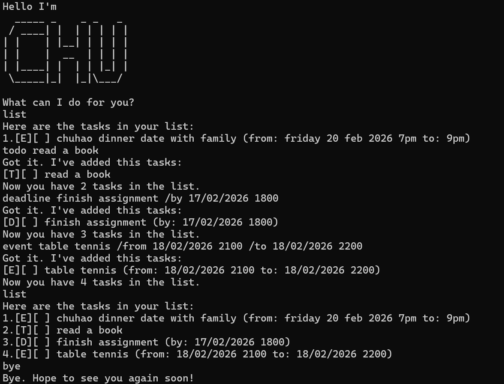

# Chu User Guide



Chu is a CLI task manager that helps you keep track of to-dos, deadlines, and events.
All interactions are done through text commands.

## Features at a glance

- `todo <description>`: Add a basic to-do task.
- `deadline <description> /by <d/M/yyyy HHmm>`: Add a task with a due date and time.
- `event <description> /from <d/M/yyyy HHmm> /to <d/M/yyyy HHmm>`: Add a task with start and end date-time.
- `list`: Show all tasks.
- `mark <index>`: Mark a task as done.
- `unmark <index>`: Mark a task as not done.
- `delete <index>`: Delete a task by index.
- `find <keyword>`: Find tasks containing a keyword.
- `bye`: Exit the app.

## Adding deadlines

Use the `deadline` command to add a task with a due date and time.
The date-time format is `d/M/yyyy HHmm`.

Example: `deadline submit report /by 2/12/2026 1800`

Expected outcome:
- The deadline task is added to your list.
- The app shows the added task and the updated number of tasks.

```
Got it. I've added this tasks:
[D][ ] submit report (by: Dec 02 2026, 6:00 PM)
Now you have 1 tasks in the list.
```

## Adding to-dos

Use the `todo` command to add a basic task without date/time.

Example: `todo read chapter 3`

Expected outcome:
- The to-do task is added to your list.
- The app shows the added task and updated task count.

```
Got it. I've added this tasks:
[T][ ] read chapter 3
Now you have 2 tasks in the list.
```

## Adding events

Use the `event` command to add a task with start and end date/time.
The date-time format is `d/M/yyyy HHmm`.

Example: `event project meeting /from 24/2/2026 1400 /to 24/2/2026 1600`

Expected outcome:
- The event task is added to your list.
- The app shows the added task and updated task count.

```
Got it. I've added this tasks:
[E][ ] project meeting (from: Feb 24 2026, 2:00 PM to: Feb 24 2026, 4:00 PM)
Now you have 3 tasks in the list.
```

## Listing tasks

Use the `list` command to display all tasks in your list.

Example: `list`

Expected outcome:
- The app prints all tasks with one-based numbering.

```
Here are the tasks in your list:
1.[T][ ] read chapter 3
2.[D][ ] submit report (by: Dec 02 2026, 6:00 PM)
3.[E][ ] project meeting (from: Feb 24 2026, 2:00 PM to: Feb 24 2026, 4:00 PM)
```

## Marking tasks

Use the `mark` command to mark a task as done.

Example: `mark 2`

Expected outcome:
- The selected task is updated to done status.

```
Nice! I've marked this tasks as done:
[D][X] submit report (by: Dec 02 2026, 6:00 PM)
```

## Unmarking tasks

Use the `unmark` command to mark a completed task as not done.

Example: `unmark 2`

Expected outcome:
- The selected task is updated to not done status.

```
OK, I've marked this tasks as not done yet:
[D][ ] submit report (by: Dec 02 2026, 6:00 PM)
```

## Deleting tasks

Use the `delete` command to remove a task by index.

Example: `delete 3`

Expected outcome:
- The selected task is removed from the list.
- The app shows the remaining number of tasks.

```
Noted, I've removed this tasks:
[E][ ] project meeting (from: Feb 24 2026, 2:00 PM to: Feb 24 2026, 4:00 PM)
Now you have 2 tasks in the list.
```

## Finding tasks

Use `find <keyword>` to show tasks containing a keyword.

Example: `find report`

Expected outcome:
- Matching tasks are printed with numbering.
- If nothing matches, an error message is shown.

```
Here are the matching tasks in your list:
1.[D][ ] submit report (by: Dec 02 2026, 6:00 PM)
```

## Exiting the app

Use `bye` to end the program.

Example: `bye`

Expected outcome:
- The app prints a farewell message and exits.

```
Bye. Hope to see you again soon!
```
